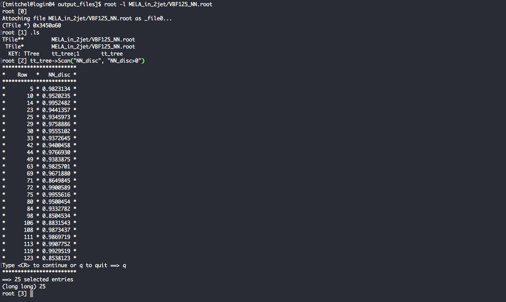

This package is used to train a fully-connected two layer network to distinguish VBF Higgs to Tau Tau from DY+Jets. The package has two main scripts:
- `train_network.py` is used to train a new model provided two input TTrees
- `run_network.py` loads a trained network and uses it to process an input TTree

# Instructions to setup the network

In order to use the framework, you must setup a virtual environment with all necessary packages installed and convert all input root files to h5 file format. The tools to setup the framework are located in the `build` directory.

    cd build

1. Setup the virtual enviroment and install all necessary python packages

        source setup.sh

    Once you have setup the virtual environment, you must activate the environment every time you login. Navigate to the top of the framework

        tmitchel@pop-os:~/Documents/HTT_NN$ pwd
        /home/tmitchel/Documents/HTT_NN

    and activate the environmnet

        source pyenv/bin/activate

2. Then, you must convert all root files to HDF5 files which are easily loaded by the network. These files must be stored in the `input_files` directory. Files will retain the same name, but different extension.

        bash convert_root_to_hdf5.sh


# Instructions for running the network

The project will take input root files and produce new root files containing all old branches in addition to the NN discriminant. You must either produce your own trained network or copy an h5 file containing the trained network into the models directory. Two models are included in the models directory to test the code.

## Training your own network

The script `train_network.py` is used to create an h5 file with a trained model. The output will be stored in the `models` directory

An example usage is shown below

```
python train_network.py -v Q2V1 Q2V2 Phi Phi1 costhetastar costheta2 costheta1 -n 7 --verbose --model_name testname
```

This will train a neural network with 1 hidden layer containing 7 nodes to separate H->TT from DY+2-Jets. The network will take [Q2V1, Q2V2, Phi, Phi1, costhetastar, costheta2, costheta1] as inputs and run printing out progress as it trains. The model best version of the model in an h5 file using the `--model_name` option to choose the file name. The h5 file will be saved in the `models` directory. 

A JSON file will also be created saving the settings used to train the network in the `model_params` directory. The name provided to --model_name will be used for naming the JSON file.

More command-line options exist for convenince. They can be seen with 

    python train_network.py -h

When run in verbose mode, the script will also produce a ROC curve saved as a pdf in the `plots` directory. An example is shown below:


## Creating your own variables

Variables not present in the input trees can be used, as long as they can be formed from other variables present in the tree. These variables cannot be provided as command-line options to `--vars`, but must be defined inside `train_network.py`. Additional variables required for selection may be defined on [Line #134](https://github.com/tmitchel/HTT_NN/blob/master/train_network.py#L134 "train_network.py"). For example, 
```python
df.insert(loc=0, column='hjj_pt', value=(higgs+j1+j2).Pt())
```

Variables to be used as input to the network may be defined on [Line #179](https://github.com/tmitchel/HTT_NN/blob/master/train_network.py#L179 "train_network.py"). You must make sure not to insert the variable to the end of the DataFrame, because the weights and labels must be in the last two columns. An example,
```python
df.insert(loc=0, column='dEtajj', value=abs(df['jeta_1'] - df['jeta_2']))
```

## Running the network on an input file

The script `run_network.py` is used to process an input file using a pre-trained network. The output will be a new root file stored in the `output_files` directory.

An example usage is shown below

    python run_network.py -i DY -l model_store.json

This will load the model parameters (including the name) from `model_store.json` and run the trained network on an input file named `DY.h5`. The output file will be `output_files/DY_NN.root` This file will contain a copy of the original TTree along with the new discriminant `NN_disc` as shown below:



More command-line options exist for convenince. They can be seen with 

    python run_network.py -h

# (Optional) Cleaning trees before conversion

If there are too many branches stored in a root file, the conversion script will fail. This typically happens once you start adding all branches required for systematic uncertainties. A short C++ file, `cleaner.cc`, is included in the `input_files` directory for producing a trimmed copy of the tree in a new ROOT file with the prefix `clean_*`. It will remove many of the branches related to systematic uncertainties. The cleaned tree can then be converted to an h5 file for training/running the network. The original ROOT file is retained so that it can be used as the input ROOT file to `run_network.py`. Then, the `NN_disc` branch will be added to the original ROOT file containing all systematic-related branches. 

The file can be compiled with g++

```
g++ -O3 cleaner.cc `root-config --cflags --glibs` -o et_Clean
```
and then run as 
```
./et_Clean DYJets1.root
```

# To-do

1. Fix code for putting NN discriminant in root files (it's pretty hacky right now)

# (DEPRECATED) Instructions about running the network

The network has many command line options. To print out all options, use

    python simple_net.py -h

Recommended first run

    python simple_net.py -v Q2V1 Q2V2 Phi Phi1 costhetastar costheta2 costheta1 -n 7 --verbose --input VBFHtoTauTau125_svFit_MELA --retrain

This command will train a neural network with one hidden layer containing 7 nodes. The network will be retrained using [Q2V1, Q2V2, Phi, Phi1, costhetastar, costheta2, costheta1] as input variables even if there is a model_checkpoint.hdf5 file. Then, all events from VBFHtoTauTau125_svFit_MELA.root will be processed by the NN and the output discriminant will be stored in a new root file.

The output root file with the NN discriminant included is

    VBFHtoTauTau125_svFit_MELA_NN.root

The HDF5 file to store the weights from the trained network is

    model_checkpoint.hdf5

